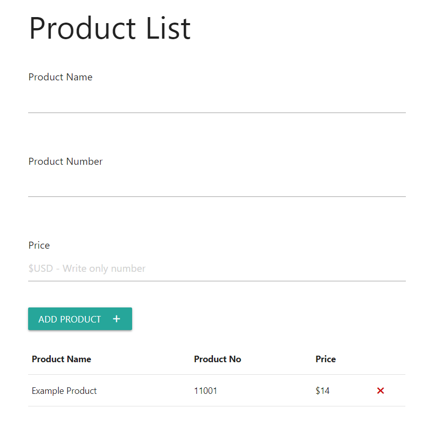

## Product List Project

- HTML5
- CSS
- Materialize CSS
- JavaScript

It is a OOP product list project that you can add or delete products in UI. All products you add or delete are saved to the Local Storage. I used Materialize CSS for clean and responsive page.

###                                                                                                                 Project Image

---

